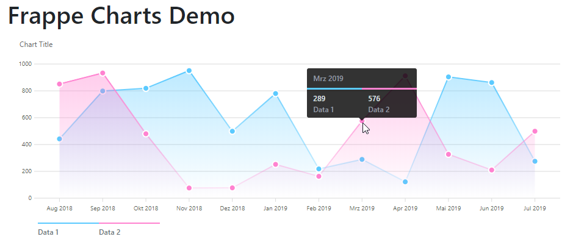

# FrappeCharts.NET

C# .Net Standard 2.0 wrapper for the Frappe Charts Javascript Library - https://frappe.io/charts

 * [Code](Code) - C# .Net Standard 2.0 Library 
 * [Demo](Demo) - Demo Chart App (.Net Core Console App)
 * [Test](Test) - xUnit Tests (not completed)
 
 
 